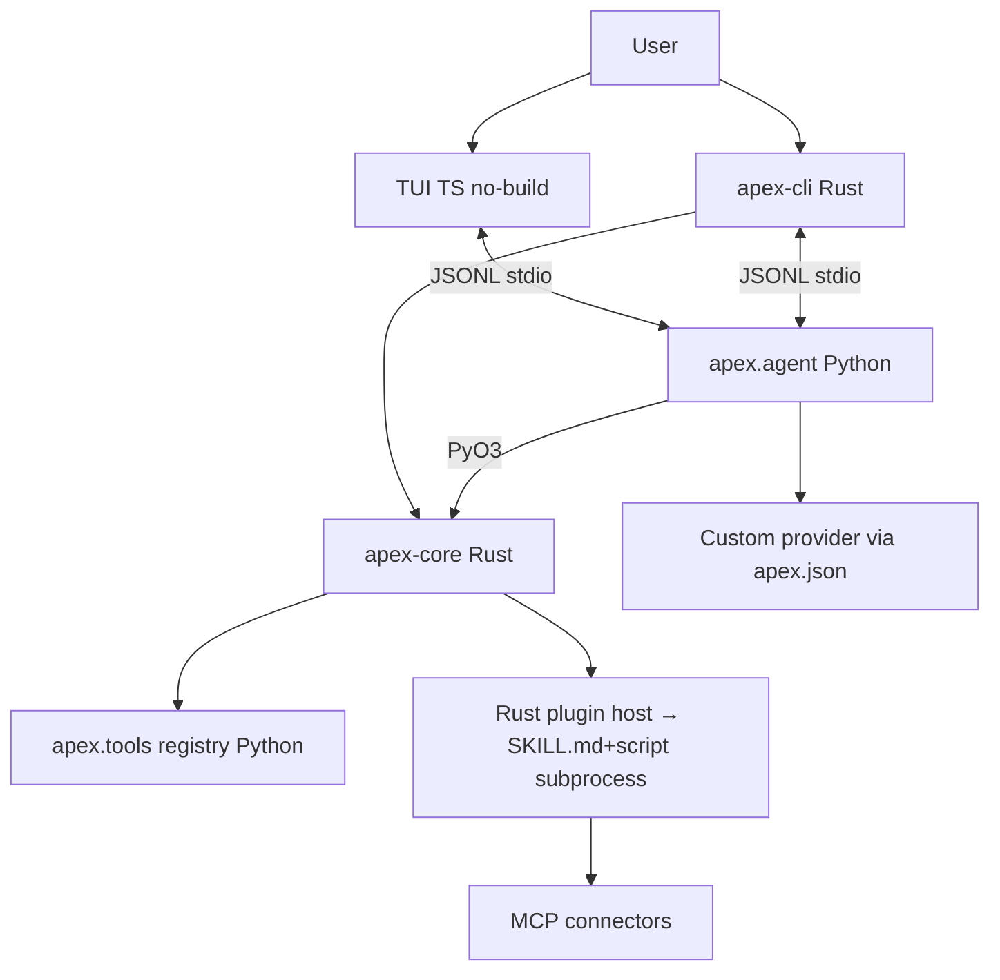

# 05 — Arsitektur

## Diagram alur



## Registry tunggal

**Prinsip:** satu otoritas tool & skill = `apex/tools/` (Python). Rust host (`apex-core`) hanya:
1. Validasi manifest `apex.skill.json`
2. Enforce permission (fs/shell/net)
3. Spawn subprocess skill
4. Route JSONL protocol

Tidak ada duplikasi registry di Rust yang bisa drift dengan Python.

## Skills reconciled

Kontradiksi awal: Lu pilih `skills_runtime=Rust native plugin` DAN `skills_format=SKILL.md+script`.

**Resolusi (dipakai):**
- **Host = Rust** (`apex-core` load manifest, enforce permission, spawn).
- **Authoring = `SKILL.md + script`** (markdown + Python/TS/binary).
- **Eksekusi = subprocess**, bukan cdylib melewati PyO3, bukan in-process.

Struktur:
```
skills/vercel-deploy/
  SKILL.md        # nama, versi, permission, entrypoint
  apex.skill.json # manifest mesin
  main.py         # atau main.ts / binary
```

Komunikasi host ↔ skill: JSONL stdio, protocol sama dengan agent.

## MCP

MCP = skill tipe khusus (`type: "mcp"` di manifest). Connector ke GitHub/DB/Notion/Linear. Tidak perlu runtime terpisah.

## State & memory

- `APEX.md` — memory proyek (rules, preferensi, konteks). Dibaca tiap sesi.
- `.apex/` — cache runtime, index, session history. Di-ignore git.
- Vector DB: V1+, tidak di-MVP.
