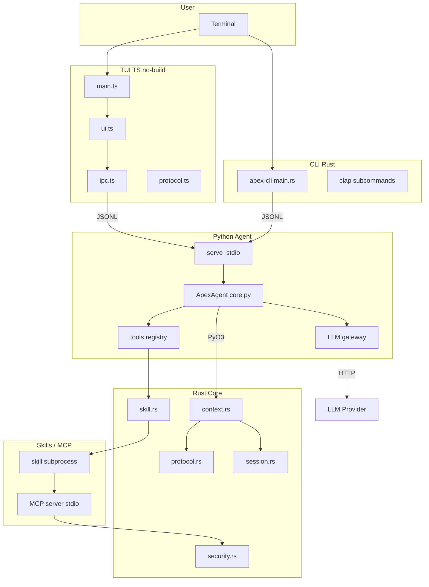

# 48 — Complete System Blueprint (master)

> Dokumen ini menggabungkan SEMUA subsystem, komponen, data flow, dan contract jadi satu master blueprint.

## 1. Peta sistem (full)



## 2. Data flow lengkap

### Chat flow

```
User → TUI → JSONL request → Python serve_stdio
→ ApexAgent.handle_chat()
→ Rust bridge.scan_context(root)
→ LLM gateway.stream(prompt)
→ emit Thinking, Message, Done events
→ JSONL response → TUI render
```

### Review flow

```
User → CLI apex review --staged
→ Python serve_stdio (ReviewRequest)
→ ApexAgent.handle_review()
→ Rust bridge.git_diff(staged=true)
→ Rule engine scan (secrets, TODO, complexity)
→ LLM reviewer
→ emit Message (issues list) + Done
→ CLI output JSON
```

### Skill run flow

```
User → CLI apex skill run <name>
→ Python serve_stdio (ToolCall skill)
→ Rust host.validate_manifest()
→ Rust host.check_permissions()
→ Rust host.spawn_subprocess()
→ Skill stdout JSONL
→ Agent forward as SkillOutput events
→ TUI/CLI render
```

## 3. Component dependencies

| Component | Depends on | Used by |
|---|---|---|
| TUI | Deno/Node, IPC | User |
| CLI | Rust, clap | User |
| Agent | Python, tools, LLM | TUI, CLI |
| Rust core | Rust, serde | Agent, CLI |
| Bridge | PyO3 | Agent |
| Skill host | Rust, subprocess | Agent |
| MCP client | Rust, stdio | Agent |
| Context engine | Rust, walkdir | Agent |
| Protocol | serde/pydantic/JSON | All |

## 4. Interface contracts

### Python ↔ Rust (PyO3)

```python
import apex_py
apex_py.scan_context(root: str) -> list[dict]
apex_py.run_skill(name: str, args: list[str]) -> Iterator[dict]
apex_py.validate_manifest(path: str) -> dict
```

### TUI/CLI ↔ Agent (JSONL stdio)

Request:
```json
{"type":"Chat","message":"..."}
```

Response stream:
```json
{"type":"Thinking","content":"..."}
{"type":"Message","role":"assistant","content":"..."}
{"type":"Done","usage":{"prompt_tokens":N,"completion_tokens":M}}
```

### Agent ↔ Skill (JSONL stdio)

Host → Skill stdin:
```json
{"action":"run","args":["..."]}
```

Skill → Host stdout:
```json
{"type":"SkillOutput","data":{...}}
{"type":"Done","result":"..."}
```

## 5. State diagram (session)

```
[Idle] --ChatRequest--> [Thinking]
[Thinking] --ToolCall--> [WaitingApproval]
[WaitingApproval] --approved--> [ToolCall]
[WaitingApproval] --rejected--> [Idle]
[ToolCall] --Done--> [Done]
[Done] --> [Idle]
[Any] --Error--> [Error] --> [Idle]
```

## 6. Error handling matrix

| Layer | Error type | Handling | Recovery |
|---|---|---|---|
| TUI | IPC disconnect | Show error panel | Restart agent |
| CLI | Invalid args | Usage error msg | Exit code 2 |
| Agent | LLM error | Retry 3x → Error event | Fallback provider |
| Rust | Scan fail | Warn + skip file | Partial result |
| Skill | Crash | Error event | Agent survive |
| MCP | Timeout | Event Error | Agent survive |

## 7. Security boundaries

| Boundary | Control |
|---|---|
| User → TUI/CLI | Input validation (allowlist) |
| TUI/CLI → Agent | JSONL schema validation |
| Agent → LLM | API key via env, no logging |
| Agent → Skill | Manifest permission check |
| Skill → FS | Subprocess isolation + fs permission |
| Skill → Net | `net` permission list |
| Agent → MCP | env token, no hardcode |

## 8. Testing matrix

| Layer | Unit | Integration | Contract | E2E |
|---|---|---|---|---|
| Rust core | ✅ | ✅ | ✅ | — |
| Python agent | ✅ | ✅ | ✅ | ✅ |
| TS TUI | ✅ | ✅ | ✅ | Manual |
| Bridge | — | ✅ | — | ✅ |
| Skill runtime | ✅ | ✅ | — | ✅ |
| MCP client | — | ✅ | — | V1 |

## 9. Deployment topology

```
User machine
├── apex CLI (Rust binary)
├── apex agent (Python process, subprocess)
├── apex TUI (TS runtime, subprocess)
└── skills/ (local plugins)

Optional V1:
├── Docker container (sandbox)
└── Remote MCP server (cloud)
```

## 10. Evolution path

| Fase | Scope |
|---|---|
| 0 | Blueprint (sekarang) |
| 1 | Foundation: bridge + context + protocol fixtures |
| 2 | MVP features: chat/review/commit/ship/skill |
| 3 | TUI full lazygit |
| 4 | V1: LSP, auto-fix, plan mode, MCP nyata |
| 5 | V2: voice, marketplace, multi-agent |
